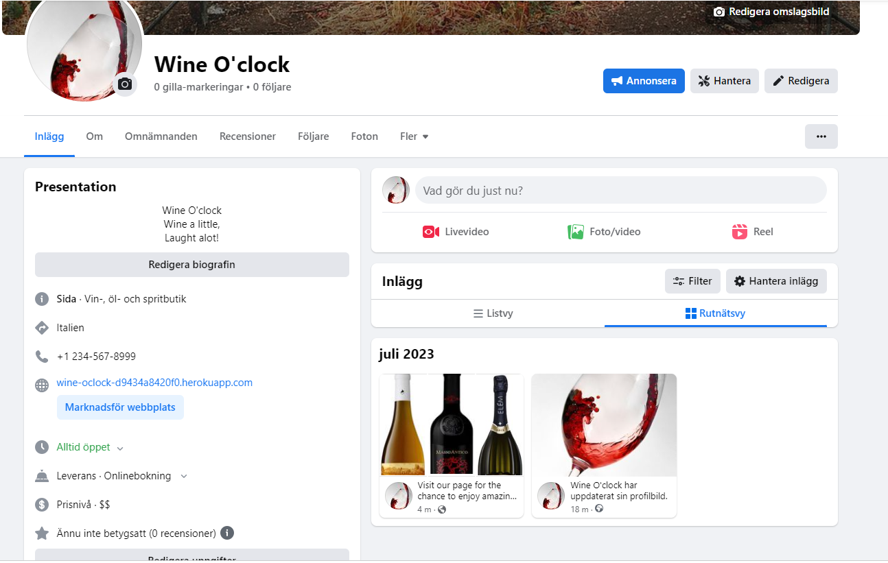

# Wine O'Clock Website

The Wine O'clock website is an e-commerce site where users can buy wine. Besides buying wine, they can also learn more about the products in stock as they all have detailed descriptions. Wine O'Clock is mainly targeted towards an older audience since it contains alcohol, but anyone of legal drinking age is able to enjoy the carefully selected products. Our business model aims to maintain exclusivity for both the wines and our customers.

What does that mean for us and the customers? Well, it means that we never have more than 100 products on our page at a time. We always offer a variety of bottles from each region and in different colors to cater to a wider audience. Additionally, since we have fewer products compared to our competitors, we can purchase larger quantities of each bottle, resulting in lower prices for everyone.

We want everyone to be able to enjoy exceptional wine!

We also use socialmedia to render a bigger audince. Moslty we use our Facebook page.

[View Wine O'Clock on Heroku Pages](https://wine-oclock-d9434a8420f0.herokuapp.com/)

## CONTENTS

* [User Experience (UX)](#User-Experience-(UX))
  * [Initial Discussion](#Initial-Discussion)
  * [User Stories](#User-Stories)

* [Design](#Design)
  * [Colour Scheme](#Colour-Scheme)
  * [Imagery](#Imagery)
  * [Wireframes](#Wireframes)
  * [Features](#Features)
  * [Accessibility](#Accessibility)

* [Technologies Used](#Technologies-Used)
  * [Languages Used](#Languages-Used)
  * [Frameworks, Libraries & Programs Used](#Frameworks,-Libraries-&-Programs-Used)

* [Deployment & Local Development](#Deployment-&-Local-Development)
  * [Deployment](#Deployment)
  * [Local Development](#Local-Development)
    * [How to Fork](#How-to-Fork)
    * [How to Clone](#How-to-Clone)

* [Testing](#Testing)
  * [W3C Validator](#W3C-Validator)
  * [Solved Bugs](#Solved-Bugs)
  * [Known Bugs](#Known-Bugs)
  * [Testing User Stories](#Testing-User-Stories)
  * [Full Testing](#Full-Testing)
  
* [Credits](#Credits)
  * [Code Used](#Code-Used)
  * [Content](#Content)
  * [Media](#Media)
  * [Acknowledgments](#Acknowledgments)

- - -

## User Experience (UX)

### Initial Discussion

The owners of Wine O'Clock spend a lot of time searching for the best wines from around the globe to offer their customers an amazing selection. They value their regular customers and aim to constantly have a wide range of wines available. To provide exceptional service, Wine O'Clock is always open, regardless of the customer's location. This means that no matter where you are in the world, Wine O'Clock is ready to serve you.

The company also assists newer wine enthusiasts by offering a curated selection of wines specifically chosen to pair well with different types of foods. This category allows customers to easily find wines that complement specific dishes.

#### Key information for the site

* Exclusive wines from around the globe.
* A wine selection tailored to complement different types of cuisine.
* A subscription form for members to stay updated on new wines.
* The ability for logged-in users to "like" products, showcasing their popularity to others.
* Links to our social media pages.
* An order history for users to easily review their past purchases.

### User Stories

#### Client GoalsHere are the revised descriptions:

#### User Goals

* To have a responsive shopping site that works well on various device sizes.
* To easily create an account and make purchases.
* To have the option to save account information for convenience during future purchases.
* To be able to search for products using a search bar or browse through categories.
* To add and remove products from the shopping bag.
* To "like" products of interest.
* To view pictures of the products.
* To read detailed information about each product.
* To register, log in, and log out with ease.
* To have a one-click option to scroll back up on the page.
* To view the entire available stock of products.

#### Admin Goals

* To easily manage and modify products by editing, adding, or deleting them.
* To view customer orders and product likes.
* To receive user feedback and tips regarding new products.

- - -

## Design

### Colour Scheme

Wine O'Clock utilizes a variety of colors to enhance the page, including the vibrant hues found in the products and the scenic backgrounds of vineyards. To ensure that the focus remains on the products themselves, we have chosen to incorporate predominantly white and pale yellow tones, allowing the products to take center stage without distractions.

### Imagery

All images of the product are taken from [Vivino](https://www.vivino.com/SE/en/) and in the json file each products also renders the specific file.

### Wireframes

Wireframes were created for mobile, tablet and desktop.

[Home Page Wireframe](media/index_page.png)

[Products Wireframe](media/product_page.png)

[Products Description Wireframe](media/description_page.png)

[Shopping Bag Wireframe](media/bag_page.png)

[Checkout Wireframe](media/checkout_page.png)

[Contact Us Wireframe](media/contact_page.png)

### Features

This e-commerce site consists of eleven pages, each serving a specific purpose to fulfill its inelevended potential.

1. The Start Page: This is the initial page users encounter upon entering the application.
2. Product Listing Page: Displays all the products available in stock.
3. Shopping Bag: Allows users to view and manage the items they have added for purchase.
4. Checkout Page: Facilitates the order payment and finalization process.
5. My Profile Page: Provides a record of past orders made by the user and users infomraation
6. Contact Us Page: Offers a means for users to get in touch with the site's administrators.
7. Subscribe Page: Enables users to subscribe to receive updates or newsletters.
8. Register Page: Allows new users to create an account on the site.
9. Login Page: Provides a secure login interface for registered users to access their accounts.
10. Logout Page: Allows users to safely log out and end their current session.
11. Description Page: Gives user moe info about the product.

These eleven pages work together to provide a comprehensive and seamless e-commerce experience for the site's visitors.

* All pages on the website have:
  * A responsive navigation menu that works on all screen sizes. It gives users the ability to search for products by character in the search bar or by category in the dropdown menus. There's a menu to register for the page, log in, log out, subscribe, and contact us. The options render depending on whether the user is logged in or not. Additionally, the logo of the page takes you back to the start page, and there is a bag icon that takes the user to their shopping bag with the selected products.
  * A footer that contains social media icon links to Instagram and Facebook.

* Home Page:
  * Contains an image of a vineyard to show the user that this e-commerce site is all about grapes of different colors. Besides the background image, we also have our slogan, "Wine a little, Laugh a lot!" and a "Shop Now" button to our products page with effects to make it more exciting.

* Register Page:
  * New customers can easily register for the page.
  * Returning customers can easily sign in.
  * Signed-in users can easily sign out.

* Products Page: On the Products page, the user can either click the wine bottle or the like button to open the product.
  * If the user presses the like button (only if the user is logged in), it will render a like on the product visible to other users. It also opens the description for the product.
  * If users click the bottle, it opens the product's description.
  * From the product description, the user can add the product to the bag, like or unlike the product, and open the image in a new window.
  * On the products page, users have the option to use an up arrow to go back to the top of the page.

* Shopping Bag Page:
  * Customers can easily add, change, and delete products in their bag.
  * Users can use a "Keep Shopping" button to go back to the products page.
  * Users can go to the secure checkout page to proceed with the order.

* Checkout Page:
  * Users can fill out a form with their billing information and choose to save it for future purchases or not. Users can also change this later under "My Profile," where they can also see their order history.

* Contact Us Page:
  * Users can send in tips about wines they think we should add to our site using a form. The form asks for a name, country, description, and what dish it pairs with. The form automatically fills in the user's username and email, and when the user submits the message, it ends up in the admin's inbox.

* Subscribe Page:
  * The Subscribe page is a form that users can fill out to receive news from the site.

* Future Implementations:
  * I would like to add a live chat where users can interact with each other and give tips about products on the page.
  * I would like the like buttons to be part of a rating system.
  * Each product should be possible to review if the user has bought it.
  * I would like to have a blog page where users can submit pictures of themselves enjoying the products.
  * I user isn't logged in a press the heart icon I want it to render a message saying "you have to log in first".

### Accessibility

I have been mindful while coding to ensure that the website is as accessible-friendly as possible. I have achieved this by:

* Using semantic HTML.
* Implementing meta tags.
* Testing the page on various screens and browsers.
* Providing descriptive alt attributes for images on the site.

- - -

## Technologies Used

### Languages Used

HTML, JavaScript, Python and CSS were used to create this website.

### Frameworks, Libraries & Programs Used

Balsamiq - Used to create wireframes.

Git - For version control.

Github - To save and store the files for the website.

Bootstrap - Framework and features on the app like the view and dropdown menus.

Stripe - To make payments possible.

Heroku - Deploy of application.

Elephant SQL - For managing PostgresSQL databases.

AWS.Amazon - Used to store data.

Google Fonts - To import the fonts used on the website.

Font Awesome - For the iconography on the website.

Google Dev Tools - To troubleshoot and test features, solve issues with responsiveness and styling.

[Favicon.io](https://favicon.io/) To create favicon.

### Rendering trafic by keywords

To drive traffic to the application, I've reused a lot of expressions throughout the website. In the product descriptions, the same flowers, fruits, and fragrances are mentioned to give higher ratings when searching for wine in the search engine.

Besides the description, the app has a catchy name, "Wine O'clock." It's inspired by the phrase "It's happy hour somewhere." The main goal with the name was to find an expression that sticks in people's minds and can also be discovered "by accident," thereby generating traffic. To finish it up, there's also a slogan: "Wine a little, laugh a lot," designed to attract people with humor.

- - -

## Deployment & Local Development

### Deployment

Heroku was used for deployment and here are the steps for deploying.

1. Sign up for a Heroku account: Go to the [Heroku website](https://www.heroku.com) and create a new account if you don't already have one.

2. Install the Heroku CLI: Download and install the Heroku Command Line Interface (CLI) tool for your operating system. The CLI allows you to interact with Heroku from the command line.

3. Prepare your app for deployment: Make sure your app is ready for deployment by ensuring all necessary dependencies and configuration files are in place. This includes setting up a Procfile that specifies how to run your app a requirements.txt file and also a env file.

4. Initialize a Git repository: If your app is not already using Git for version control, initialize a new Git repository in the root directory of your app.

5. Log in to Heroku from the CLI: Open a terminal or command prompt, and log in to Heroku by running the command heroku login. Follow the prompts to enter your Heroku account credentials.

6. Push your code to Heroku: Use the command git push heroku main to deploy your code to Heroku. This will upload your app's code and dependencies to Heroku's servers.

7. Set up environment variables (optional): If your app relies on environment variables for configuration, you can set them using the Heroku CLI. Run heroku config:set VARIABLE_NAME=variable_value for each environment variable you need to set.

Open your app in the browser: Go to setting in Heroku and you'll find a link to your page to see your deployed app there.

### Local Development

#### How to Fork

To fork the Wine O'clock repository:

1. Log in (or sign up) to Github.
2. Go to the repository for this project, ohdamnitsnikki/Wine O'clock.
3. Click the Fork button in the top right corner.

#### How to Clone

To clone the Wine O'clock repository:

1. Log in (or sign up) to GitHub.
2. Go to the repository for this project, ohdamnitsnikki/Wine O'clock.
3. Click on the code button, select whether you would like to clone with HTTPS, SSH or GitHub CLI and copy the link shown.
4. Open the terminal in your code editor and change the current working directory to the location you want to use for the cloned directory.
5. Type 'git clone' into the terminal and then paste the link you copied in step 3. Press enter.

- - -

## Testing

During the app building process, we conducted various tests to ensure the functionality and quality of the application. The following types of testing were performed:

1. **Unit Testing**: We implemented unit tests to verify the correctness of individual components, functions, and modules within the app. This helped identify any issues or bugs at a granular level.

2. **Integration Testing**: We conducted integration tests to check the proper integration and interaction between different components, ensuring they functioned seamlessly together.

3. **User Interface (UI) Testing**: We thoroughly tested the user interface to ensure a consistent and user-friendly experience across different devices and screen sizes. This involved testing various UI elements, navigation, responsiveness, and visual aesthetics.

4. **Functional Testing**: We performed functional tests to validate that all the features and functionalities of the app were working as expected. This included testing user interactions, form submissions, data processing, and any external integrations.

5. **Performance Testing**: We assessed the app's performance to ensure it met the required standards. This involved analyzing load times, response times, and resource utilization under different user loads or stress conditions.

6. **Compatibility Testing**: We tested the app across multiple browsers, operating systems, and devices to ensure compatibility and consistent behavior. This helped identify any issues specific to certain platforms or configurations.

Throughout the development process, we iteratively performed these tests, fixing any issues or bugs that were discovered. By following a comprehensive testing approach, we aimed to deliver a robust, reliable, and user-friendly app to our users.

### W3C Validator

The [W3C validator](https://jigsaw.w3.org/css-validator/) was used to validate the HTML on all pages of the website. 

When I started to validate my app, it was already deployed to Heroku. This meant that every time I corrected an error and pushed it to Heroku, it took a few minutes to rebuild the page and provide me with the modified link. When I had errors on parts that were consistent throughout the site, like the navbar, for example, it kept rendering the same errors if I didn't wait long enough.

To speed up the process, I decided to validate the template codes rather than the deployed website's address.

Little did I know that it would raise concerns about the fact that none of the files, besides the base.html, included the meta tags and so on. Additionally, it wasn't too happy about the way I rendered Python code into the template.

To ensure that I had no errors, I went through all the error messages, even though a few of them were not actual errors for the application, and made sure to fix the ones related to semantics. I have now learned that `<li>` doesn't go inside the `<menu>` element, and `<small>` cannot contain a `<form>`.

To conclude, it means that I do not have a valid symbol to add in this HTML context.

On a positive note, my base.css file passed without any issues.

    

### Solved Bugs

1. My biggest challenge has been ensuring that the page looks good on various screen sizes. I still have a lot to learn about Bootstrap to achieve the desired visual appearance.

2. When implementing the like button, I overlooked the context in the view, which resulted in the likes being rendered but not changing the appearance accordingly.

3. On smaller devices, the shopping bag now renders in a stacked manner. Although it may not look ideal, it is a significant improvement from the previous layout.

### Known Bugs

1. When filling out the form to make a purchase, some of the fields are required in order to proceed. However, it's worth noting that the form accepts blank spaces without text as valid input for submitting the form. However, submitting the form with blank spaces will result in a 404 error, and the purchase won't go through. 

The payment form, which utilizes Stripe, is adapted from the walkthrough project "Boutique Ado." As long as the user fills out the form with text, it functions correctly and processes the payment accordingly.

### Testing User Stories

* First Time Visitors
  * I want to find out what is Bully Book Club and how I can take part.
  The about us and join us sections of the home page answer some common questions and explain how to take part.

  

  * I want to be able to navigate the site easily to find information.
  All site navigation is in the top navigation bar, which consistantly appears on all pages of the site. As you are able to scroll for a long time on the book page, a return to top has been added to make it easy for users to return to the navigation menu.

  
  
  

  * I want to be able to find their Instagram profile.  
    The instagram icon and link for Bully Book Club is presented on each page in the footer. This opens a new browser window to instagram for a good user experience.

    

* Returning Visitors
  * I want to find up to date information on what the book club is reading.
  In the navigation menu there is are links to take you directly to what the book club is currently reading and what they will be reading next. The books also display a badge showing that this book is the current read and reading next.

  
  
  

  * I want to be able to easily contact the book club with questions I might have.
  A contact us page provides a form that users can fill in to contact the book club with any questions they might have. The use of a text area input allows the user to ask their specific question. The footer also contains an envelope icon which users can click to go to the contact us form from any page.

  

* Frequent Visitors
  * I want to be able to recommend a book for the book club to read.
  The contact us page allows users to select a checkbox for book recommendations. They are then able to add the books information into the text area.

  

### Full Testing

To conduct comprehensive testing of my website, I performed the following tests using different browsers such as Google Chrome, Safari, and Mozilla Firefox, and various devices including a MacBook Pro (14 inch) and iPhone 13 Pro.

Additionally, I utilized Google Chrome Developer Tools to examine each page and ensure their responsiveness across different screen sizes.

Moreover, I enlisted the help of friends and family, who examined the page with a critical eye to identify any errors. Based on their feedback, all implemented features are functioning as expected, and no significant issues were identified during testing.

Read [TESTING.md](TESTING.md)

- - -

## Credits

### Code Used

* [Abi Harrison's Meta Tags webinar and repository](https://github.com/Abibubble/meta-tags-example)
* [Tutorial to change bullet images to emojis](https://daily-dev-tips.com/posts/css-emoji-list-style/)
* [Dave Horrocks Copepen for the scroll to top](https://codepen.io/daveyjh/pen/GRMmqOO)

### Content

* The content for the website was primarily written by Nicole Stjernberg, the owner of Wine O'Clock. However, the product descriptions have been borrowed and modified from real customers who have written reviews about the wine on [Vivino](https://www.vivino.com/SE/en/).

* Regarding the application itself, it is heavily inspired by the Boutique Ado project, and most of the models used, apart from my own, are taken from that project. The JSON file is also sourced from there, but I have customized it to match the products for my own ecommerce site.

* I would like to express my gratitude to Harry, a mentor from Code Institute, who has provided valuable assistance, solutions, and ideas for my project.

* I have also received valuable assistance from the tutor support throughout this journey.